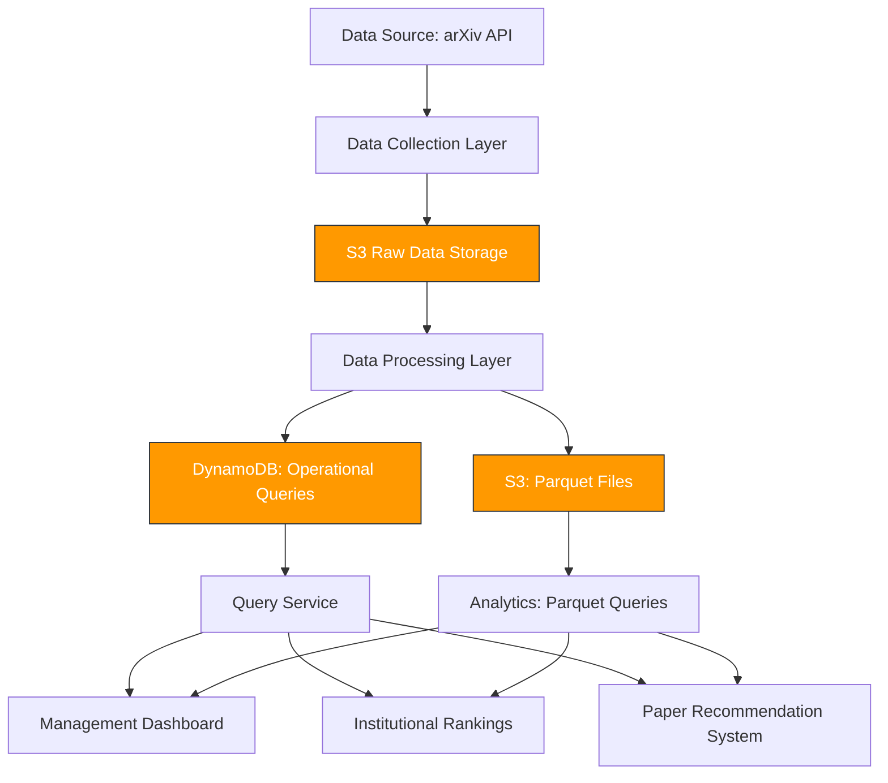

# arXiv Data Processing Platform

> Data Engineering Project for HackMD 2025

A scalable, reusable, and configurable pipeline for collecting and processing arXiv metadata to support academic research and institutional decision-making.

## 1. Project Overview & Architecture

### Vision

This project establishes a robust data infrastructure for arXiv metadata, providing a solid foundation for three key analytical use cases:
1. **Management Dashboard**: To monitor academic trends, co-authorship networks, and institutional submissions.
2. **Institutional Rankings**: To produce subject-wise rankings based on publication quantity and quality.
3. **Paper Recommendation System**: To recommend papers using NLP techniques on metadata and future user behavior data.

### System Architecture

The platform is designed with a modular, multi-layered architecture that can be deployed on AWS services for scalability and maintainability.

- **Data Collection**: A configurable collector that can fetch incremental updates from the arXiv OAI-PMH API.
- **Data Processing**: A Python-based ETL pipeline that cleans, normalizes, and enriches metadata, with support for both historical batch processing and incremental updates.
- **Storage Strategy**:
    - **S3**: Designed for raw and processed data storage, leveraging Parquet format for efficient analytical queries.
    - **DynamoDB**: Designed for storing key-value pairs or metadata requiring low-latency access.
- **Analytics Layer**: A conceptual layer that will consume data from the storage layer to power the three main use cases.

## 2. Implementation Status & Scope

This section details the current state of the project, distinguishing between **completed, partially implemented, and planned features.**

### 2.1 Completed Functionality
The core ETL pipeline is fully functional and provides a robust foundation for all downstream applications.

- **Data Ingestion**: A reusable and configurable pipeline to collect data from the arXiv OAI-PMH API.
- **Data Processing**: The Python processing script can handle both historical snapshots (`arxiv-metadata-oai-snapshot.json`) and incremental updates. It performs comprehensive data cleaning, normalization, and reconciliation of different metadata formats.
- **Derived Metrics**: The pipeline successfully calculates and stores several key metrics:
    - `update_frequency`: Tracks the number of paper revisions.
    - `submission_to_publication_time`: Measures the time from arXiv submission to official publication.
- **Data Storage**:
    - **Historical Data Processing**: The `process_history` module can process large historical datasets and output them in Parquet format with year/month/day partitioning.
    - **Incremental Processing**: The main processing pipeline is designed to store daily incremental updates in DynamoDB for efficient, low-latency updates and queries on individual records.
- **Data Quality**: The processing script includes built-in data quality checks. It logs statistics on missing titles, abstracts, and authors, providing a quality report after each run.
- **Query Service**: A comprehensive query service (`query.py`) provides various query patterns for analytical use cases including paper lookups, category-based queries, date range queries, and institutional statistics.

### 2.2 Partially Implemented & Future Work
While the core pipeline is solid, some advanced features are considered **work in progress** or **planned enhancements**.

- **AWS Infrastructure Deployment**:
    - **Current Status**: Lambda function code and deployment scripts exist but have not been deployed to AWS. The system currently runs locally.
    - **To Be Implemented**: Deploy the Lambda functions, EventBridge rules, and create the necessary AWS resources (S3 buckets, DynamoDB tables, IAM roles).
- **Unified Query Experience**:
    - **Current Status**: Historical data processing and incremental processing are implemented as separate modules, but there's no unified query layer yet.
    - **To Be Implemented**: A **Unified Query Layer** will be introduced to provide a seamless data view. This can be achieved by leveraging **AWS Athena** to query the S3 data lake and integrating with DynamoDB queries, creating a single access point for all analytical needs.
- **Data Quality Monitoring & Alerting**:
    - **Current Status**: The pipeline logs data quality metrics to console/logs.
    - **To Be Implemented**: A dedicated alerting mechanism (e.g., using AWS SNS) based on predefined thresholds for missing data or anomalies, integrated with CloudWatch.
- **Full Observability Dashboard**:
    - **Current Status**: Logs and basic metrics are available in console output.
    - **To Be Implemented**: A prototype for a comprehensive Grafana or CloudWatch dashboard to visualize pipeline health, performance metrics (run time, throughput), and data quality statistics in a unified view.
- **Fault Tolerance & Recovery**:
    - **Current Status**: The pipeline is idempotent and includes basic retry mechanisms for API calls.
    - **To Be Implemented**: A more sophisticated stateful recovery mechanism. For instance, tracking failed records in a Dead Letter Queue (DLQ) to enable targeted reprocessing without affecting the main pipeline.
- **External Data Integration for Rankings**:
    - **Current Status**: The pipeline stores `journal_ref` and `primary_category` as initial indicators for quality and subject.
    - **To Be Implemented**: Integration with external datasets (e.g., journal impact factors, citation counts) to provide a more robust basis for institutional rankings.
- **User Behavior Tracking for Recommendations**:
    - **Current Status**: The system stores all necessary metadata (`title`, `abstract`, `authors`) for content-based recommendations.
    - **To Be Implemented**: A separate data collection stream to capture user browse and interaction data, which is crucial for a fully-featured recommendation system.

## 3. Rationale Behind Design Choices

### 3.1 Architectural Rationale: Dual Storage Strategy

Our architecture employs a dual storage strategy to optimize for both **performance** and **cost-efficiency**, tailored to the characteristics of the arXiv dataset.

- **For historical data (4.5 GB)**: The initial snapshot is processed and stored in **Parquet format with date partitioning**. This decision was made to handle large data volumes efficiently during the initial load, leveraging Parquet's compression and columnar storage for analytical queries. This serves as our long-term, immutable data lake for historical analysis.
- **For daily incremental updates**: Since daily updates are small but require frequent updates to existing records (e.g., adding a new version to a paper), **DynamoDB** was chosen. It provides fast, low-latency writes and updates for individual records, which is not efficiently supported by immutable Parquet files.

While this dual-strategy is highly effective for data ingestion, it creates a challenge for a unified data querying experience. Our proposed solution to this is to build a **Unified Query Layer**, as detailed in the **Partially Implemented & Future Work** section, which allows downstream users to query both data sources seamlessly.

### 3.2 Data Quality and Safeguards

- **Inconsistent Data Handling**: The arXiv dataset has several challenges, including inconsistent metadata schemas and missing fields. My solution addresses this with a robust **reconciliation logic** that merges data from different formats and handles null values gracefully.
- **Anomaly Detection**: The processing script calculates metrics like missing field percentages. Anomaly detection can be layered on top of these metrics to alert when the quality of incoming data deviates from historical norms.
- **Fault Tolerance**: The pipeline is designed to be **idempotent**, meaning it can be rerun multiple times without duplicating data. This is crucial for recovery from unexpected failures.

### 3.3 Challenges with arXiv Metadata

During implementation, I encountered several key challenges:
- **Author & Institution Metadata**: The raw data often lacks standardized author identifiers or explicit institution names. My solution derives institutions from submitter email domains, which is a common but not foolproof approach. This highlights the need for a future standardization process.
- **Temporal Inconsistencies**: The versioning of papers can be complex. My processing logic carefully reconstructs the paper's update history to accurately calculate metrics like `update_frequency` and `submission_to_publication_time`.
- **Data Volume**: The full arXiv snapshot is a large file (~4.5 GB). The Python processing script handles this by reading the data in chunks, preventing memory overload and allowing for parallel processing.
