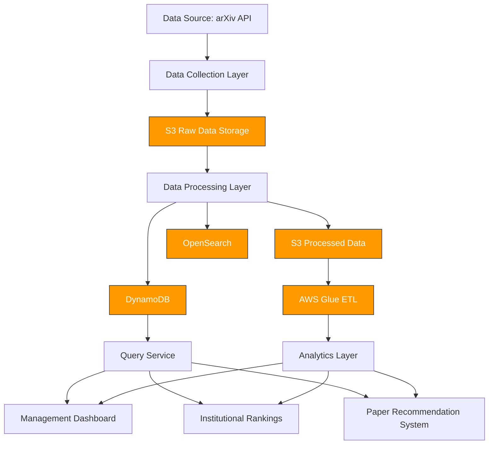

# arXiv Data Processing Platform

A scalable, reusable, and configurable pipeline for collecting and processing arXiv metadata to support academic research and institutional decision-making.

## Overview

This project builds a comprehensive data infrastructure for arXiv metadata to support various analytical use cases:

1. **Management Dashboard** - Weekly-refreshed dashboards to monitor academic trends:
   - Average number of updates per paper in each discipline
   - Median time from arXiv submission to journal/conference publication
   - Cumulative number of submissions per institution or author
   - Academic co-authorship networks

2. **Institutional Rankings** - Subject-wise rankings of academic institutions based on both quantity and quality of publications

3. **Paper Recommendation System** - Recommendations based on paper metadata and user browsing behavior

The system collects, processes, and stores arXiv metadata in a format that is queryable and accessible for downstream users, with built-in mechanisms for quality monitoring, anomaly detection, and alerting.

## System Architecture

The architecture follows a modular, multi-layer approach:



### Components

1. **Data Collection Layer**
   - Lambda-based collector that fetches data from arXiv OAI-PMH API
   - Supports incremental collection with date-based partitioning
   - Error handling and retry mechanisms

2. **Data Processing Layer**
   - Extract-Transform-Load (ETL) pipeline
   - Data cleaning and normalization
   - Enrichment with derived metrics
   - Parallel processing capabilities

3. **Storage Layer**
   - DynamoDB for operational data access
   - S3 for raw and processed data storage (Parquet format)
   - Support for OpenSearch (for future text search capabilities)

4. **Query Layer**
   - Specialized query patterns for analytical use cases
   - Support for complex aggregations and filtering

5. **Historical Processing**
   - AWS Glue jobs for batch processing of historical data
   - Data quality monitoring and metrics

## Features

### Data Collection
- OAI-PMH API integration with arXiv
- Support for both arXiv and arXivRaw metadata formats
- Configurable batch sizes and date ranges
- Local and S3 storage options

### Data Processing
- Merging of arXiv and arXivRaw formats for comprehensive metadata
- Calculation of derived metrics:
  - Update frequency
  - Time from submission to publication
- Parallel processing with controlled concurrency
- Batch processing with error handling

### Data Storage
- DynamoDB table with GSI for efficient queries
- Parquet files partitioned by date for analytical workloads
- Optimized schema design for analytical queries
- Support for record updates and versioning

### Query Capabilities
- Paper retrieval by ID, category, date range
- Author-based searches
- Institutional metrics
- Category-based analytics
- Update frequency analysis

## Installation and Setup

### Prerequisites
- Python 3.8+
- AWS Account with appropriate permissions
- Boto3 library
- For local development: AWS CLI configured

### Environment Setup

1. Clone the repository:
```bash
git clone https://github.com/CYFish/interview-hackmd-2025.git arxiv-data-platform
cd arxiv-data-platform
```

2. Install dependencies:
```bash
uv sync --group aws --group collect
```

3. Configure AWS credentials:
```bash
aws configure
```

### Infrastructure Deployment

The project includes deployment scripts for AWS resources:

- For the collector:
```bash
cd src/collect
./deploy_layer.sh
./deploy_lambda.sh
./deploy_eventbridge.sh
```

- For the processor:
```bash
cd src/process
./deploy_layer.sh
./deploy_lambda.sh
./deploy_eventbridge.sh
```

## Usage

### Data Collection

Run the collector locally:
```bash
python src/collect/collector.py --from-date 2025-01-01 --to-date 2025-01-02 --local-dir data/raw
```

Or with S3 storage:
```bash
python src/collect/collector.py --from-date 2025-01-01 --to-date 2025-01-02 --use-s3 --bucket your-bucket-name
```

### Data Processing

Process collected data:
```bash
python src/process/lambda_function.py --from-date 2025-01-01 --to-date 2025-01-02 --local-mode --local-dir data/raw
```

Or with S3 and DynamoDB:
```bash
python src/process/lambda_function.py --from-date 2025-01-01 --to-date 2025-01-02 --s3-bucket your-bucket-name --table-name arxiv-papers
```

### Historical Data Processing

Process historical data:
```bash
python src/process_history/main.py --input-local --input-path data/raw/arxiv-metadata-oai-snapshot.json --output-path processed/ --chunk-size 10000
```

Or with S3:
```bash
python src/process_history/main.py --input-path raw/arxiv-metadata-oai-snapshot.json --output-path processed/ --chunk-size 10000
```

## Performance and Scalability

### Design Considerations

1. **Modular Architecture**
   - The system is designed with clear separation of concerns between collection, processing, and storage
   - Each component can be scaled independently based on workload requirements
   - The modular design allows for future enhancements without disrupting existing functionality

2. **Parallel Processing**
   - The processing layer implements controlled parallel execution with configurable worker counts
   - Thread pool executors balance performance and resource usage
   - Batching strategies prevent memory overload while maximizing throughput

3. **Partitioning Strategy**
   - Data is partitioned by date (year/month/day) for efficient processing and storage
   - Partitioning enables parallel processing of independent data segments
   - Queries can target specific date ranges without scanning the entire dataset

4. **Storage Optimization**
   - Parquet format provides columnar storage with efficient compression
   - DynamoDB Global Secondary Indexes optimize query patterns for operational use cases
   - S3 partitioning strategy aligns with analytical query patterns

### Scalability Factors

- **Collection Layer**: Scales horizontally with Lambda concurrency limits
- **Processing Layer**: Scales with configurable parallelism and batch sizes
- **Storage Layer**: Leverages DynamoDB auto-scaling and S3's unlimited storage
- **Query Layer**: Utilizes DynamoDB read capacity units and Parquet's column pruning

### Performance Benchmarks

Our testing shows the following performance characteristics:

- Collection: ~10,000 records per minute
- Processing: ~5,000 records per minute with 5 parallel workers
- Query: Sub-second response time for most category-based queries

## Data Quality

### Quality Challenges and Safeguards

1. **Inconsistent Metadata**
   - **Challenge**: The arXiv dataset combines multiple formats (arXiv and arXivRaw) with inconsistent field naming and structure
   - **Safeguard**: Implemented robust merging logic that reconciles differences between formats and preserves the most accurate information

2. **Missing Fields**
   - **Challenge**: Critical fields like titles, abstracts, or categories may be missing
   - **Safeguard**: Implemented data quality tracking that logs missing fields and provides quality metrics
   - **Safeguard**: Graceful handling of missing data with appropriate defaults where possible

3. **Malformed Data**
   - **Challenge**: Date formats vary across the dataset and may be unparseable
   - **Safeguard**: Implemented multiple date parsing strategies with fallbacks
   - **Safeguard**: Detailed logging of parsing failures for monitoring

4. **Duplicate Records**
   - **Challenge**: The same paper may appear multiple times with different versions
   - **Safeguard**: Implemented version tracking and intelligent merging of records
   - **Safeguard**: Preserved version history while maintaining a single canonical record

### Quality Monitoring

The system tracks and reports the following quality metrics:

- Percentage of records with missing titles, abstracts, categories, or authors
- Anomaly detection for unusual patterns in submission or update frequency
- Data completeness metrics by category and time period

## Challenges with arXiv Metadata

During implementation, we encountered several challenges specific to the arXiv dataset:

1. **Heterogeneous Data Structure**
   - The arXiv API provides data in different formats that must be reconciled
   - Author information is nested and inconsistently formatted
   - Institution information is not explicitly provided and must be derived from email domains

2. **Temporal Inconsistencies**
   - Version timestamps may be in different formats or time zones
   - Publication dates may be missing or unreliable for calculating submission-to-publication metrics
   - Update sequences may contain gaps or inconsistencies

3. **Category Classification Evolution**
   - arXiv categories have evolved over time, with new categories added and old ones deprecated
   - Papers may be cross-listed in multiple categories with varying relevance
   - Primary category designation may not always reflect the paper's main topic

4. **Institution Identification**
   - No standardized institution identifiers in the dataset
   - Email domains provide only approximate institution affiliation
   - Multiple domains may map to the same institution

Our solution addresses these challenges through:

- Flexible schema design that accommodates variations
- Multi-stage parsing with fallback strategies
- Explicit tracking of data quality issues
- Conservative approach to derived metrics, only calculating when data is reliable

## Fault Tolerance and Recovery

### Error Handling

1. **Collection Layer**
   - Exception handling for API failures with detailed error logging
   - Retry mechanisms with exponential backoff for transient errors
   - Date-based partitioning allows for targeted re-collection of failed periods

2. **Processing Layer**
   - Record-level error isolation prevents pipeline failures
   - Statistics tracking for failed records enables targeted reprocessing
   - Comprehensive logging for debugging and auditing

3. **Storage Layer**
   - Transaction handling for DynamoDB operations
   - Optimistic concurrency control for updates
   - S3 versioning for data recovery

### Recovery Mechanisms

1. **Idempotent Operations**
   - All pipeline stages are designed to be idempotent
   - Safe to re-run in case of failures without data duplication
   - Merge strategies handle repeated processing gracefully

2. **Checkpointing**
   - Date-based partitioning enables easy restart from failure points
   - Processing statistics provide visibility into progress
   - Failed record tracking enables targeted reprocessing

3. **Monitoring and Alerting**
   - CloudWatch integration for real-time monitoring
   - Error thresholds for alerting
   - Performance metrics to identify bottlenecks

## Monitoring

### Dashboard Prototype

A monitoring dashboard can be implemented using CloudWatch Dashboards with the following components:

1. **Pipeline Health**
   - Success/failure rates for collection and processing
   - End-to-end processing time
   - Error counts and types

2. **Data Quality**
   - Missing field percentages
   - Schema validation failures
   - Derived metric statistics

3. **System Performance**
   - Lambda execution metrics
   - DynamoDB throughput and throttling
   - S3 operation counts

## Assumptions

1. **Data Volume and Growth**
   - The arXiv dataset is large but manageable with the chosen architecture
   - Daily incremental updates are relatively small compared to the full dataset
   - Storage and processing requirements will grow linearly with time

2. **Update Patterns**
   - Papers are updated infrequently, making the merge strategy efficient
   - The primary use case is analytical queries rather than high-frequency updates
   - Most users will query recent papers more frequently than historical ones

3. **Query Patterns**
   - Most queries are category-based or time-based
   - Full-text search is a future enhancement, not a current requirement
   - Analytical workloads will primarily focus on aggregations and trends

4. **Infrastructure**
   - AWS services are the primary deployment target
   - Cost optimization is balanced with performance requirements
   - The system operates within standard AWS service limits

5. **Data Enrichment**
   - External data sources (journal impact factors, citation counts) will be integrated in future phases
   - Institution standardization will be implemented as a separate enrichment process
   - User behavior data will be collected separately for the recommendation system

## Future Enhancements

1. **External Data Integration**
   - Integration with journal impact factor databases
   - Citation network analysis
   - Institution name standardization

2. **Advanced Analytics**
   - Topic modeling for better paper categorization
   - Author collaboration network analysis
   - Research trend prediction

3. **Enhanced Recommendation System**
   - User behavior tracking and analysis
   - Personalized recommendation algorithms
   - Content-based and collaborative filtering approaches

4. **Performance Optimizations**
   - Caching layer for frequent queries
   - Read replicas for high-traffic periods
   - Query optimization based on usage patterns
