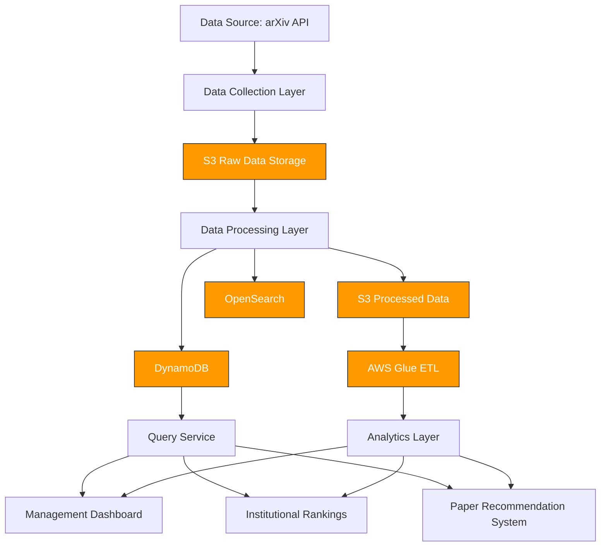

# arXiv Data Processing Platform

A scalable, reusable, and configurable pipeline for collecting and processing arXiv metadata to support academic research and institutional decision-making.

## Table of Contents

- [Overview](#overview)
- [System Architecture](#system-architecture)
- [Features](#features)
- [Installation and Setup](#installation-and-setup)
- [Usage](#usage)
- [Performance and Scalability](#performance-and-scalability)
- [Data Quality](#data-quality)
- [Fault Tolerance and Recovery](#fault-tolerance-and-recovery)
- [Monitoring](#monitoring)
- [Assumptions](#assumptions)

## Overview

This project builds a comprehensive data infrastructure for arXiv metadata to support various analytical use cases:

1. **Management Dashboard** - Weekly-refreshed dashboards to monitor academic trends
2. **Institutional Rankings** - Subject-wise rankings of academic institutions
3. **Paper Recommendation System** - Recommendations based on paper metadata

The system collects, processes, and stores arXiv metadata in a format that is queryable and accessible for downstream users, with built-in mechanisms for quality monitoring, anomaly detection, and alerting.

## System Architecture

The architecture follows a modular, multi-layer approach:



### Components

1. **Data Collection Layer**
   - Lambda-based collector that fetches data from arXiv OAI-PMH API
   - Supports incremental collection with date-based partitioning
   - Error handling and retry mechanisms

2. **Data Processing Layer**
   - Extract-Transform-Load (ETL) pipeline
   - Data cleaning and normalization
   - Enrichment with derived metrics
   - Parallel processing capabilities

3. **Storage Layer**
   - DynamoDB for operational data access
   - S3 for raw and processed data storage
   - Support for OpenSearch (for future text search capabilities)

4. **Query Layer**
   - Specialized query patterns for analytical use cases
   - Support for complex aggregations and filtering

5. **Historical Processing**
   - AWS Glue jobs for batch processing of historical data
   - Data quality monitoring and metrics

## Features

### Data Collection
- OAI-PMH API integration with arXiv
- Support for both arXiv and arXivRaw metadata formats
- Configurable batch sizes and date ranges
- Local and S3 storage options

### Data Processing
- Merging of arXiv and arXivRaw formats for comprehensive metadata
- Calculation of derived metrics:
  - Update frequency
  - Time from submission to publication
- Parallel processing with controlled concurrency
- Batch processing with error handling

### Data Storage
- DynamoDB table with GSI for efficient queries
- Optimized schema design for analytical queries
- Support for record updates and versioning

### Query Capabilities
- Paper retrieval by ID, category, date range
- Author-based searches
- Institutional metrics
- Category-based analytics
- Update frequency analysis

## Installation and Setup

### Prerequisites
- Python 3.8+
- AWS Account with appropriate permissions
- Boto3 library
- For local development: AWS CLI configured

### Environment Setup

1. Clone the repository:
```bash
git clone https://github.com/yourusername/arxiv-data-platform.git
cd arxiv-data-platform
```

2. Install dependencies:
```bash
pip install -r src/collect/requirements.txt
pip install -r src/process/requirements.txt
```

3. Configure AWS credentials:
```bash
aws configure
```

### Infrastructure Deployment

The project includes deployment scripts for AWS resources:

- For the collector:
```bash
cd src/collect
./deploy_layer.sh
./deploy_lambda.sh
./deploy_eventbridge.sh
```

- For the processor:
```bash
cd src/process
./deploy_layer.sh
./deploy_lambda.sh
./deploy_eventbridge.sh
```

- For historical processing:
```bash
cd src/process_history
./deploy_glue.sh
```

## Usage

### Data Collection

Run the collector locally:
```bash
python src/collect/collector.py --from-date 2025-01-01 --to-date 2025-01-02 --local-dir data
```

Or with S3 storage:
```bash
python src/collect/collector.py --from-date 2025-01-01 --to-date 2025-01-02 --use-s3 --bucket your-bucket-name
```

### Data Processing

Process collected data:
```bash
python src/process/lambda_function.py --from-date 2025-01-01 --to-date 2025-01-02 --local-mode --local-dir data
```

Or with S3 and DynamoDB:
```bash
python src/process/lambda_function.py --from-date 2025-01-01 --to-date 2025-01-02 --s3-bucket your-bucket-name --table-name arxiv-papers
```

### Querying Data

Run queries on processed data:
```bash
python src/process/query.py --query category --category cs.AI --limit 10
python src/process/query.py --query updates
python src/process/query.py --query publication-time
python src/process/query.py --query institutions --limit 20
```

## Performance and Scalability

### Design Considerations

1. **Parallel Processing**
   - The system uses concurrent processing with controlled batch sizes to optimize throughput
   - Thread pool executors with configurable worker counts balance performance and resource usage

2. **Partitioning Strategy**
   - Data is partitioned by date for efficient processing and storage
   - Each date partition can be processed independently, enabling horizontal scaling

3. **Throttling Management**
   - Built-in delays between API calls and batch operations to prevent rate limiting
   - Adaptive retry mechanisms with exponential backoff

4. **Storage Optimization**
   - DynamoDB table design optimized for query patterns with appropriate GSIs
   - S3 storage organized for efficient data retrieval and Glue job processing

### Scalability Factors

- **Collection Layer**: Scales with Lambda concurrency limits
- **Processing Layer**: Scales with configurable parallelism and batch sizes
- **Storage Layer**: DynamoDB auto-scaling and S3's unlimited storage
- **Query Layer**: DynamoDB read capacity units and caching strategies

## Data Quality

### Quality Measures

1. **Schema Validation**
   - Type checking and conversion for all fields
   - Handling of missing or malformed data

2. **Deduplication**
   - Record merging logic to handle duplicate submissions
   - Version tracking to maintain data lineage

3. **Data Cleaning**
   - Text normalization for titles and abstracts
   - Structured parsing of author information

4. **Derived Metrics**
   - Calculation of update frequency and publication time metrics
   - Statistical validation of derived values

### Potential Data Issues

1. **Inconsistent Metadata**
   - The system handles differences between arXiv and arXivRaw formats
   - Robust merging logic resolves conflicts

2. **Missing Fields**
   - Graceful handling of missing data with appropriate defaults
   - Logging of data quality issues for monitoring

3. **Format Changes**
   - Flexible schema design to accommodate API changes
   - Version tracking in the processing pipeline

## Fault Tolerance and Recovery

### Error Handling

1. **Collection Layer**
   - Exception handling for API failures
   - Retry mechanisms for transient errors
   - Detailed logging for troubleshooting

2. **Processing Layer**
   - Record-level error handling to prevent pipeline failures
   - Statistics tracking for failed records
   - Isolation of processing errors to maintain pipeline integrity

3. **Storage Layer**
   - Transaction handling for DynamoDB operations
   - Optimistic concurrency control for updates

### Recovery Mechanisms

1. **Idempotent Operations**
   - All pipeline stages designed to be idempotent
   - Safe to re-run in case of failures

2. **Checkpointing**
   - Date-based partitioning enables easy restart from failure points
   - Processing statistics provide visibility into progress

3. **Monitoring and Alerting**
   - CloudWatch integration for real-time monitoring
   - Error thresholds for alerting

## Monitoring

### Metrics

The system tracks and reports the following metrics:

1. **Collection Metrics**
   - Total records processed
   - Success/failure rates
   - Processing time

2. **Processing Metrics**
   - Transformation success rates
   - Data quality indicators
   - Processing duration

3. **Storage Metrics**
   - Write throughput and latency
   - Record counts by category
   - Storage utilization

### Dashboard Prototype

A monitoring dashboard can be implemented using CloudWatch Dashboards with the following components:

1. **Pipeline Health**
   - Success/failure rates for collection and processing
   - End-to-end processing time
   - Error counts and types

2. **Data Quality**
   - Missing field percentages
   - Schema validation failures
   - Derived metric statistics

3. **System Performance**
   - Lambda execution metrics
   - DynamoDB throughput and throttling
   - S3 operation counts

## Assumptions

1. **Data Volume**
   - The arXiv dataset is large but manageable with the chosen architecture
   - Daily incremental updates are relatively small compared to the full dataset

2. **Update Patterns**
   - Papers are updated infrequently, making the merge strategy efficient
   - The primary use case is analytical queries rather than high-frequency updates

3. **Query Patterns**
   - Most queries are category-based or time-based
   - Full-text search is a future enhancement, not a current requirement

4. **Infrastructure**
   - AWS services are the primary deployment target
   - Cost optimization is balanced with performance requirements
